# Migration Intelligence Agent — Build Plan

## Architecture Overview

```mermaid
flowchart TD
    User["User Query"] --> Orchestrator
    Orchestrator -->|classify_intent| IntentClassifier["Intent Classifier\npush_factor / destination\nhistorical / real_time / relocation_advisory"]

    subgraph step1 [Step 1: Collect — tools selected by intent]
        IntentClassifier --> ScoutAgent["Scout Agent"]
        ScoutAgent --> UNHCR["UNHCR API"]
        ScoutAgent --> WorldBank["World Bank API"]
        ScoutAgent --> ACLED["ACLED API"]
        ScoutAgent --> Teleport["Teleport API"]
        ScoutAgent --> NewsAPI["NewsAPI + GDELT"]
        ScoutAgent --> OpenMeteo["Open-Meteo API"]
        ScoutAgent --> ILO["ILO ILOSTAT API"]
        ScoutAgent --> OpenAQ["OpenAQ API\nreal-time AQI"]
        ScoutAgent --> DuckDB["DuckDB Cache\none table per API + TTL"]
    end

    subgraph step2 [Step 2: EDA — Adaptive Fan-out with explicit tool calls]
        PushFactor["Push Factor Analyst\nTool: run_correlation_analysis\nTool: run_granger_test\nTool: run_sql_query groupby year"]
        DestTracker["Destination Tracker\nTool: run_sql_query filter+rank\nTool: run_growth_rate\nTool: haversine_distance"]
        PatternDet["Pattern Detective\nTool: run_cosine_similarity\nTool: run_lag_analysis\nTool: gdelt_sentiment_score"]
        RelocScorer["Relocation Scorer\nTool: run_sql_query rank by AQI\nTool: run_sql_query healthcare score\nTool: run_sql_query education score"]
    end

    subgraph step3 [Step 3: Hypothesize]
        HypothesisAgent["Hypothesis Agent\nHypothesisReport with citations\ncompeting hypotheses\nchart captions from EDA"]
    end

    IntentClassifier -->|"push_factor: PushFactor primary"| PushFactor
    IntentClassifier -->|"destination: DestTracker primary"| DestTracker
    IntentClassifier -->|"historical: PatternDet primary"| PatternDet
    IntentClassifier -->|"real_time: all + news priority"| PushFactor
    IntentClassifier -->|"real_time: all + news priority"| DestTracker
    IntentClassifier -->|"real_time: all + news priority"| PatternDet
    IntentClassifier -->|"relocation_advisory: RelocScorer primary"| RelocScorer

    ScoutAgent -->|cached MigrationDataset| PushFactor
    ScoutAgent -->|cached MigrationDataset| DestTracker
    ScoutAgent -->|cached MigrationDataset| PatternDet
    ScoutAgent -->|cached MigrationDataset| RelocScorer

    PushFactor --> HypothesisAgent
    DestTracker --> HypothesisAgent
    PatternDet --> HypothesisAgent
    RelocScorer --> HypothesisAgent

    HypothesisAgent --> StreamlitUI["Streamlit Frontend\nreport + tables + citations\ncompeting hypotheses\nchart captions + news feed"]
```




## Dynamic Routing — How the Orchestrator Adapts

The orchestrator classifies every user query into one of four intent types **before** data collection begins. Intent controls which APIs the Scout Agent calls, which EDA agents run, and how tools are invoked differently for the same agent:


| Intent                | Example Queries                                                       | Primary EDA Agent | APIs Prioritized                                                | DuckDB SQL Pattern                                                                             |
| --------------------- | --------------------------------------------------------------------- | ----------------- | --------------------------------------------------------------- | ---------------------------------------------------------------------------------------------- |
| `push_factor`         | "Why are people leaving Venezuela?"                                   | PushFactor        | WorldBank + ACLED + ILO + climate                               | `GROUP BY indicator ORDER BY correlation DESC`                                                 |
| `destination`         | "Where are Syrians going?"                                            | DestTracker       | UNHCR destinations + Teleport + WorldBank GDP                   | `GROUP BY destination_country ORDER BY refugee_count DESC`                                     |
| `historical`          | "Is this like Zimbabwe 2007?"                                         | PatternDet        | UNHCR multi-country + WorldBank historical                      | `WHERE country IN (query, Syria, Zimbabwe) ORDER BY year`                                      |
| `real_time`           | "What's happening now in Sudan?"                                      | All three         | NewsAPI + GDELT + ACLED (last 90 days only)                     | `WHERE date >= NOW() - INTERVAL 90 DAY`                                                        |
| `relocation_advisory` | "I live in India, where should I move for better AQI and healthcare?" | RelocScorer       | OpenAQ + WorldBank healthcare + Teleport education + Open-Meteo | `SELECT country, aqi, healthcare_score, education_score ORDER BY weighted_score DESC LIMIT 10` |


The secondary agents still run for all intents but receive a reduced context window and lower token budget, so the primary agent's findings dominate the hypothesis.

### Relocation Advisory — Step-by-Step Workflow Example

Query: *"I am a resident of India. I want to move to a country with better AQI and proper healthcare. Education matters. Cost of living does not matter."*

1. **Intent classified** → `relocation_advisory`. Weights extracted: `{aqi: 0.40, healthcare: 0.35, education: 0.25, cost_of_living: 0.0}`
2. **Scout Agent** hits (in parallel, all live — no static data):
  - `get_aqi_by_country(origin="India")` → OpenAQ API returns India's baseline AQI (`pm2.5 = 58.1 µg/m³`)
  - `get_aqi_by_country(scope="global", top_n=50)` → OpenAQ returns live AQI for 50 countries
  - `get_indicator("SH.XPD.CHEX.GD.ZS")` → World Bank returns healthcare expenditure % of GDP per country
  - `get_indicator("SH.MED.PHYS.ZS")` → World Bank returns physicians per 1000 people
  - `get_indicator("SE.XPD.TOTL.GD.ZS")` → World Bank returns education spending % of GDP
  - `get_city_scores(scope="global")` → Teleport returns education + healthcare Teleport scores for 200+ cities
  - `get_climate_data(scope="global")` → Open-Meteo returns temperature + precipitation per country
  - All responses written to DuckDB: `aqi_data`, `economic_indicators`, `city_scores`, `climate_data` tables
3. **EDA — Relocation Scorer agent** makes explicit tool calls:
  - `run_sql_query("SELECT country, AVG(pm25) as avg_aqi FROM aqi_data GROUP BY country ORDER BY avg_aqi ASC LIMIT 20")` → surfaces 20 lowest-AQI countries with exact values
  - `run_sql_query("SELECT country, healthcare_exp_gdp, physicians_per_1000 FROM economic_indicators WHERE year=2023 ORDER BY healthcare_exp_gdp DESC")` → surfaces top healthcare spenders with specific numbers
  - `run_sql_query("SELECT country, aqi.avg_aqi, econ.healthcare_exp_gdp, teleport.education_score FROM aqi_data JOIN economic_indicators econ USING(country) JOIN city_scores teleport USING(country)")` → joins all three tables
  - `run_sql_query("SELECT country, (0.40*(1-norm_aqi) + 0.35*norm_healthcare + 0.25*norm_education) AS weighted_score FROM scored_countries ORDER BY weighted_score DESC LIMIT 10")` → computes the user's weighted suitability score live
  - Surfaces specific output: `[{country: "New Zealand", weighted_score: 0.89, aqi: 4.2, healthcare_rank: 3}, {country: "Finland", weighted_score: 0.86, ...}]`
4. **Hypothesis Agent** receives the ranked list and specific numbers — generates `HypothesisReport` with:
  - Headline: "New Zealand is the strongest match for your criteria, scoring 0.89/1.0 based on live AQI of 4.2 µg/m³ (86% better than India's 58.1), healthcare expenditure of 9.7% of GDP, and Teleport education score of 79.4/100"
  - Citations: each number linked back to exact API endpoint + indicator code + fetch timestamp
  - Competing hypotheses: "Finland scores 0.86 — higher healthcare (10.8% GDP) but slightly worse AQI (5.1 µg/m³) and stricter immigration path"
  - Chart: bar chart of top-10 countries by weighted score with AQI/healthcare/education breakdown, caption derived from EDA
5. **Streamlit** renders: ranked table, bar chart with captions, citations table, competing options card, confidence score

## New Data Sources Added


| Category          | API                                                  | Auth              | What It Provides                                                                   |
| ----------------- | ---------------------------------------------------- | ----------------- | ---------------------------------------------------------------------------------- |
| News              | NewsAPI (`newsapi.org`)                              | Free API key      | Latest headlines, publication counts, article snippets about the country           |
| News sentiment    | GDELT GKG (`gdeltproject.org`)                       | None — fully free | Country-level tone scores, event volume, media attention index                     |
| Climate / Weather | Open-Meteo (`open-meteo.com`)                        | None — fully free | Historical temperature, precipitation, extreme event frequency by country centroid |
| Employment        | ILO ILOSTAT (`ilostat.ilo.org/resources/sdmx-tools`) | None — fully free | Unemployment rate, youth unemployment, labor force participation, hours worked     |
| Safety            | Teleport (already in plan) + ACLED (already in plan) | Already covered   | Composite safety score: Teleport urban safety + ACLED conflict event density       |


## Project Structure

```
Migration-Intelligence-Agent/
├── .env.example
├── requirements.txt
├── README.md
├── app.py                        # Streamlit frontend entry point
├── agents/
│   ├── orchestrator.py           # Routes query, manages lifecycle
│   ├── scout_agent.py            # Tool-calling collector agent
│   ├── push_factor_analyst.py    # EDA: correlations & ranking
│   ├── destination_tracker.py    # EDA: destination patterns
│   ├── pattern_detective.py      # EDA: historical comparisons + news overlay
│   └── hypothesis_agent.py       # Final structured report
├── tools/
│   ├── unhcr_tools.py            # UNHCR REST API calls
│   ├── worldbank_tools.py        # World Bank REST API calls
│   ├── acled_tools.py            # ACLED REST API (key required)
│   ├── teleport_tools.py         # Teleport open API (quality + safety)
│   ├── news_tools.py             # NewsAPI headlines + GDELT sentiment  [NEW]
│   ├── climate_tools.py          # Open-Meteo historical climate data   [NEW]
│   ├── employment_tools.py       # ILO ILOSTAT labor market data        [NEW]
│   └── duckdb_tools.py           # Cache + SQL query layer
├── models/
│   └── schemas.py                # Pydantic output schemas
├── analysis/
│   ├── correlation.py            # Registered tool: run_correlation_analysis, run_granger_test, run_lag_analysis, run_growth_rate
│   ├── stats_tools.py            # Registered tool: run_cosine_similarity, haversine_distance, run_anomaly_detect
│   └── visualization.py          # Plotly chart builders (multi-panel)
└── cache/                        # DuckDB persisted Parquet files
```

## Key Files & What They Do

### `requirements.txt`

- `google-adk` — Google Agent Development Kit (multi-agent framework + Gemini integration)
- `google-generativeai` — Gemini model API client
- `httpx` — async HTTP for all API calls
- `pandas`, `scipy`, `scikit-learn` — Pearson, cosine similarity, EDA
- `statsmodels` — Granger causality tests
- `duckdb`, `pyarrow` — second data source (SQL on cached Parquet)
- `plotly` — interactive multi-panel charts
- `streamlit` — frontend
- `python-dotenv` — env management
- `geopy` — haversine distance for destination proximity
- `pydantic` — data schemas (still used for `output_schema` in ADK agents)

### `models/schemas.py`

Extended Pydantic schemas:

```python
class NewsItem(BaseModel):
    title: str
    source: str
    published_at: str
    sentiment_score: float          # from GDELT tone, -10 to +10

class ClimateSnapshot(BaseModel):
    avg_temp_anomaly_c: float       # deviation from 1991-2020 baseline
    annual_precipitation_mm: float
    extreme_heat_days_per_year: int
    climate_risk_label: str         # "low" | "moderate" | "high" | "severe"

class SafetySummary(BaseModel):
    teleport_safety_score: float    # 0-100 from Teleport
    acled_events_last_year: int     # raw conflict event count
    acled_fatalities_last_year: int
    composite_safety_score: float   # normalized 0-1

class EmploymentData(BaseModel):
    unemployment_rate: float
    youth_unemployment_rate: float
    labor_force_participation: float
    year: int

class Citation(BaseModel):
    claim: str                    # the exact sentence being cited
    value: str                    # the specific number, e.g. "58.1 µg/m³"
    source_api: str               # e.g. "OpenAQ API"
    indicator_code: str           # e.g. "pm25" or "NY.GDP.MKTP.KD.ZG"
    endpoint_url: str             # the actual URL that was called
    fetched_at: str               # ISO 8601 timestamp of the API call

class CompetingHypothesis(BaseModel):
    hypothesis: str               # alternative explanation or destination
    evidence_for: list[str]       # data points supporting it (with numbers)
    evidence_against: list[str]   # data points refuting it (with numbers)
    probability_score: float      # 0.0–1.0 relative to primary

class ChartPanel(BaseModel):
    fig_json: str                 # Plotly JSON string
    caption: str                  # EDA-derived explanatory sentence, not generic
    data_sources: list[str]       # which APIs/tables produced this chart's data

class HypothesisReport(BaseModel):
    headline: str                              # one-sentence claim with embedded numbers
    supporting_points: list[DataPoint]         # each has claim + specific number
    citations: list[Citation]                  # full data lineage for every claim
    competing_hypotheses: list[CompetingHypothesis]  # 2-3 alternatives with evidence
    primary_vs_alternatives: str               # narrative comparing primary to alternatives
    counter_argument: str
    counter_rebuttal: str
    confidence_score: float                    # 0.0–1.0 based on correlation strength
    top_push_factors: list[PushFactor]         # ranked by r-value (migration intents)
    top_destinations: list[ScoredDestination]  # ranked by weighted score (relocation intent)
    destination_insights: list[str]
    historical_template: str                   # "economic_collapse" | "conflict_displacement" | "climate_driven" | "relocation_advisory"
    news_sentiment_summary: str
    climate_risk_assessment: str
    employment_outlook: str
    safety_assessment: str
    charts: list[ChartPanel]                   # each chart has EDA-derived caption
    recent_headlines: list[NewsItem]
    data_freshness: dict[str, str]             # {api_name: fetched_at} for transparency
```

### `tools/` — Tool Calling (Core Requirement)

- `unhcr_tools.py`: `get_displacement_data(country, year_from, year_to)` — `https://api.unhcr.org/population/v1/`
- `worldbank_tools.py`: `get_indicator(country_code, indicator, years)` — `https://api.worldbank.org/v2/country/{code}/indicator/{ind}` (no auth)
- `acled_tools.py`: `get_conflict_events(country, date_from, date_to)` — `https://api.acleddata.com/acled/read` (free key)
- `teleport_tools.py`: `get_city_scores(city_slug)` — `https://api.teleport.org/api/urban_areas/slug:{city}/scores/`
- `news_tools.py`: `get_country_news(country, from_date)` — hits `https://newsapi.org/v2/everything` (free key); `get_gdelt_sentiment(country)` — hits `https://api.gdeltproject.org/api/v2/doc/doc` (no auth)
- `climate_tools.py`: `get_climate_data(lat, lon, year_from, year_to)` — hits `https://archive-api.open-meteo.com/v1/archive` (no auth, free); returns temperature and precipitation history
- `employment_tools.py`: `get_employment_data(country_code, year_from, year_to)` — hits `https://sdmx.ilo.org/rest/data/ILO,DF_STI_ALL_UNE_TUNE_SEX_AGE_RT` (no auth, free)
- `aqi_tools.py`: `get_aqi_by_country(country_or_scope, top_n)` — hits `https://api.openaq.org/v3/locations` (no auth, free); returns live PM2.5 and AQI per city/country
- `duckdb_tools.py`: One DuckDB table per API, keyed by `(country, year_range)`, with TTL-based invalidation:
  - `aqi_data` — TTL 2 hours (pollution readings change)
  - `news_articles` — TTL 1 hour (real-time headlines)
  - `conflict_events` — TTL 4 hours (ACLED near-real-time)
  - `economic_indicators` — TTL 24 hours (World Bank / ILO data)
  - `city_scores` — TTL 24 hours (Teleport scores)
  - `climate_data` — TTL 7 days (historical climate rarely changes)
  - `displacement_data` — TTL 24 hours (UNHCR annual data)
  - Cache check: before any API call, `SELECT fetched_at FROM {table} WHERE country=? AND year_range=?` — if within TTL, return cached rows. If expired or missing, re-fetch live. Expose `run_sql_query(sql)` for EDA agents — this is the **second data retrieval method** elective

### `agents/orchestrator.py` — Google ADK Root Agent (SequentialAgent)

The pipeline is a Google ADK `SequentialAgent` — it runs Scout → EDA (ParallelAgent) → Hypothesis in order, with state passed between steps via `context.state` and `output_key`.

```python
from google.adk.agents import Agent, LlmAgent, SequentialAgent, ParallelAgent

# Step 1: Intent classifier + Scout (sequential)
intent_agent = LlmAgent(
    name="intent_classifier",
    model="gemini-2.5-flash",
    instruction="Classify the user query into one of: push_factor | destination | historical | real_time | relocation_advisory. Extract country, year range, and user-specified weights. Output as JSON.",
    output_schema=IntentConfig,
    output_key="intent_config"
)

# Step 2: EDA fan-out (parallel)
eda_parallel = ParallelAgent(
    name="eda_parallel",
    sub_agents=[push_factor_agent, destination_tracker_agent,
                pattern_detective_agent, relocation_scorer_agent]
    # ADK runs all sub_agents concurrently; each writes to its own output_key in state
)

# Step 3: Root pipeline
root_pipeline = SequentialAgent(
    name="migration_pipeline",
    sub_agents=[intent_agent, scout_agent, eda_parallel, hypothesis_agent]
)
```

**State flow between agents** (ADK `context.state`):

- `intent_agent` → writes `state["intent_config"]`
- `scout_agent` → reads `state["intent_config"]`, writes `state["migration_dataset"]`
- Each EDA agent → reads `state["migration_dataset"]`, writes `state["push_factor_result"]` / `state["destination_result"]` / `state["pattern_result"]` / `state["relocation_result"]`
- `hypothesis_agent` → reads all four state keys, writes `state["hypothesis_report"]`

### `agents/scout_agent.py` — Google ADK `Agent` with 9 tools

```python
scout_agent = Agent(
    name="scout_agent",
    model="gemini-2.5-flash",
    instruction="""Read state['intent_config']. Call the appropriate tools based on api_priority.
    Normalize all responses into a MigrationDataset. Cache every response to DuckDB.
    Write the merged dataset to state['migration_dataset'].""",
    tools=[
        get_unhcr_data, get_worldbank_indicator, get_acled_events,
        get_city_scores, get_country_news, get_gdelt_sentiment,
        get_climate_data, get_employment_data, get_aqi_data,
        cache_to_duckdb  # writes each API response to its DuckDB table
    ],
    output_schema=MigrationDataset,
    output_key="migration_dataset"
)
```

All tools are plain Python functions with docstrings — ADK uses the docstring as the tool description for the Gemini model's function-calling interface. No static data in tool implementations — every function makes a live HTTP call.

### `agents/push_factor_analyst.py` — Google ADK `LlmAgent` (Code Execution + Stats)

```python
push_factor_agent = LlmAgent(
    name="push_factor_analyst",
    model="gemini-2.5-flash",
    instruction="""Read state['migration_dataset']. Make tool calls to:
    1. run_sql_query to GROUP BY year, indicator on cached economic data
    2. run_correlation_analysis to rank push factors by Pearson r-value vs migration outflow
    3. run_granger_test to establish causal direction and lag in years
    4. If any r < 0.3, call run_growth_rate on that indicator as fallback
    Surface the specific top driver, its r-value, Granger lag, and inflection year.""",
    tools=[run_sql_query, run_correlation_analysis, run_granger_test, run_growth_rate, run_anomaly_detect],
    output_schema=PushFactorResult,
    output_key="push_factor_result"
)
```

Surfaces: `{"top_driver": "inflation", "r": 0.91, "granger_lag_years": 2, "inflection_year": 2019, "p_value": 0.003}`

### `agents/destination_tracker.py` — Google ADK `LlmAgent` (Filtering + Grouping)

```python
destination_tracker_agent = LlmAgent(
    name="destination_tracker",
    model="gemini-2.5-flash",
    instruction="""Read state['migration_dataset']. Make tool calls to:
    1. run_sql_query: GROUP BY destination_country, SUM(refugees) ORDER BY DESC LIMIT 10
    2. haversine_distance for each top destination vs origin country centroid
    3. run_sql_query: JOIN destination GDP from worldbank_data table
    Surface the specific anomaly where absorption pattern defies proximity or wealth expectation.""",
    tools=[run_sql_query, haversine_distance, run_growth_rate],
    output_schema=DestinationResult,
    output_key="destination_result"
)
```

Surfaces: `"Colombia absorbed 38% of outflow (2.9M) despite being 4x closer than Spain and 3x poorer"`

### `agents/pattern_detective.py` — Google ADK `LlmAgent` (NLP + Similarity)

```python
pattern_detective_agent = LlmAgent(
    name="pattern_detective",
    model="gemini-2.5-flash",
    instruction="""Read state['migration_dataset']. Make tool calls to:
    1. gdelt_sentiment_score — get monthly tone scores; find the month tone first dropped sharply
    2. run_sql_query: load Syria 2011 and Zimbabwe 2007 rows from the same DuckDB tables as baselines
    3. run_cosine_similarity against each baseline indicator vector
    4. run_lag_analysis between news_sentiment and migration_outflow series
    Surface the best-matching template and the news lead time in months.""",
    tools=[run_sql_query, run_cosine_similarity, run_lag_analysis, gdelt_sentiment_score],
    output_schema=PatternResult,
    output_key="pattern_result"
)
```

Surfaces: `{"template": "economic_collapse", "similarity_to_zimbabwe": 0.87, "news_lead_months": 14}`

### `agents/relocation_scorer.py` — Google ADK `LlmAgent` (Relocation Advisory)

```python
relocation_scorer_agent = LlmAgent(
    name="relocation_scorer",
    model="gemini-2.5-flash",
    instruction="""Only activate if state['intent_config'].intent == 'relocation_advisory'.
    Otherwise return an empty RelocationResult immediately.
    If active, make tool calls to:
    1. run_sql_query: GROUP BY country, AVG(pm25) ORDER ASC — lowest-AQI countries with exact values
    2. run_sql_query: JOIN aqi_data + economic_indicators + city_scores on country key
    3. run_sql_query: compute weighted_score = (w_aqi*(1-norm_aqi) + w_health*norm_health + w_edu*norm_edu)
       using weights from state['intent_config']
    Surface top-10 ranked countries with exact numeric scores per dimension.""",
    tools=[run_sql_query, run_anomaly_detect],
    output_schema=RelocationResult,
    output_key="relocation_result"
)
```

### `agents/hypothesis_agent.py` — Google ADK `LlmAgent` with `output_schema` (Structured Output Elective)

```python
hypothesis_agent = LlmAgent(
    name="hypothesis_agent",
    model="gemini-2.5-flash",
    instruction="""Read state keys: push_factor_result, destination_result, pattern_result, relocation_result.
    Rules:
    - Every supporting_point MUST quote a number present verbatim in those state values
    - Every Citation MUST include the endpoint_url from the original tool call
    - competing_hypotheses MUST have 2+ alternatives with data-backed evidence_for and evidence_against
    - chart captions MUST be EDA-derived insight sentences, not generic titles
    - Do NOT fabricate any statistic not present in the EDA state values.""",
    output_schema=HypothesisReport,    # ADK enforces Gemini structured output matching this schema
    output_key="hypothesis_report"
    # No tools — reads from context.state, enforces structured JSON output via output_schema
)
```

### `analysis/correlation.py` — Registered EDA Tool Module

Exposes functions registered as tools that EDA agents call explicitly:

```python
def run_correlation_analysis(data: dict, target_col: str) -> CorrelationResult:
    # runs scipy.stats.pearsonr and spearmanr for every indicator vs target
    # returns ranked list of {indicator, pearson_r, spearman_r, p_value}

def run_granger_test(cause: list[float], effect: list[float], max_lag: int) -> GrangerResult:
    # statsmodels grangercausalitytests
    # returns {lag_years, f_stat, p_value, is_causal}

def run_lag_analysis(series_a: list[float], series_b: list[float]) -> LagResult:
    # cross-correlation at lags 1–5; returns optimal lag + correlation at that lag

def run_growth_rate(series: list[float], years: list[int]) -> GrowthResult:
    # CAGR and YoY growth rate; returns {cagr, peak_growth_year, trough_year}
```

### `analysis/stats_tools.py` — Registered Similarity + Geo Tool Module

```python
def run_cosine_similarity(vec_a: list[float], vec_b: list[float]) -> float:
    # sklearn cosine_similarity on normalized indicator vectors

def haversine_distance(coord_a: tuple, coord_b: tuple) -> float:
    # geopy great-circle distance in km

def run_anomaly_detect(series: list[float], years: list[int]) -> AnomalyResult:
    # z-score threshold anomaly detection; returns {anomaly_years, z_scores}
```

### `analysis/visualization.py`

Builds a four-panel Plotly figure:

1. Dual-axis: inflation rate vs. migration outflow over time
2. Climate anomaly bar chart (temperature deviation per year)
3. News sentiment timeline (GDELT tone score)
4. Employment trend (unemployment rate over time)

All panels returned as `fig.to_json()` inside `ChartData`.

### `app.py` — Streamlit Frontend

- Free-text query input (natural language)
- Sidebar: intent override toggle, year range slider, ACLED toggle, news date range, cost-of-living weight slider (for relocation intent)
- Pipeline spinner showing live phase labels: "Collecting data…", "Running EDA…", "Forming hypothesis…"
- Renders (all derived from live API data via HypothesisReport JSON):
  - Headline card (one-sentence claim with embedded numbers)
  - Ranked table: countries or push factors with specific numeric values per row
  - Citations table: claim | value | source API | indicator code | endpoint URL | fetched at
  - Competing hypotheses card: primary vs alternatives with evidence for/against each
  - Captioned Plotly charts (caption is the EDA-derived insight, not a generic title)
  - Safety score meter
  - Latest headlines feed (top 5 with GDELT sentiment score badges)
  - Climate risk card
  - Employment snapshot card
  - Data freshness indicator (which APIs were live vs cached)
  - Confidence score progress bar
  - Full JSON expander at bottom

## Data Flow Summary

1. User query → Orchestrator classifies intent → produces `IntentConfig` with weights and API priority
2. Scout Agent receives `IntentConfig`, checks DuckDB TTL cache per table → fetches only stale/missing data live, caches results
3. EDA agents run via `asyncio.gather()` (1–4 agents depending on intent), each making explicit tool calls on DuckDB:
  - `run_sql_query` for filtering, grouping, ranking, joining across API tables
  - `run_correlation_analysis` / `run_granger_test` / `run_cosine_similarity` for statistics
  - `gdelt_sentiment_score` for deterministic NLP
  - Each agent surfaces a **specific number or anomaly** — not a generic summary
4. Hypothesis Agent receives specific findings → returns `HypothesisReport` with full citations, competing hypotheses, EDA-captioned charts — every claim traceable to an API endpoint + indicator code + timestamp
5. Streamlit renders: ranked table, citation table, competing hypotheses card, captioned charts, news feed

## Runtime Estimate


| Phase                                  | First Run (no cache)            | Cached Run                 |
| -------------------------------------- | ------------------------------- | -------------------------- |
| Intent classification                  | 2–3s                            | 2–3s                       |
| Scout Agent API calls (parallel)       | 5–10s (bottleneck: slowest API) | <1s (all tables valid TTL) |
| DuckDB write                           | 1–2s                            | —                          |
| EDA agents parallel (`asyncio.gather`) | 15–25s (LLM calls dominate)     | 15–25s                     |
| Hypothesis Agent                       | 10–15s                          | 10–15s                     |
| Streamlit render                       | 1–2s                            | 1–2s                       |
| **Total**                              | **~35–57s**                     | **~28–45s**                |


The LLM inference inside EDA and Hypothesis agents is the dominant cost. API calls (5–10s parallel) are fast and are eliminated on cached runs.

## API Notes

- **World Bank**: `https://api.worldbank.org/v2` — no auth, free | DuckDB TTL: 24h
- **UNHCR**: `https://api.unhcr.org/population/v1/` — no auth, free | DuckDB TTL: 24h
- **Teleport**: `https://api.teleport.org/api` — no auth, free | DuckDB TTL: 24h
- **OpenAQ**: `https://api.openaq.org/v3/locations` — no auth, free | DuckDB TTL: 2h
- **ACLED**: free registration at acleddata.com → `ACLED_API_KEY` + `ACLED_EMAIL` in `.env` | DuckDB TTL: 4h
- **NewsAPI**: free registration at newsapi.org → `NEWS_API_KEY` in `.env` (100 req/day) | DuckDB TTL: 1h
- **GDELT**: `https://api.gdeltproject.org` — no auth, fully free, no rate limit | DuckDB TTL: 1h
- **Open-Meteo**: `https://archive-api.open-meteo.com` — no auth, fully free | DuckDB TTL: 7d
- **ILO ILOSTAT**: `https://sdmx.ilo.org/rest` — no auth, fully free | DuckDB TTL: 24h
- **Gemini (Google ADK)**: `gemini-2.5-flash` → `GOOGLE_API_KEY` in `.env` (get from [aistudio.google.com](https://aistudio.google.com))

## Grab-Bag Electives Covered

- **Code Execution**: `push_factor_analyst.py` calls `run_correlation_analysis` + `run_granger_test` tools backed by pandas/scipy/statsmodels
- **Structured Output**: `HypothesisReport` Pydantic schema enforced by Google ADK `output_schema=HypothesisReport` on the hypothesis agent — Gemini outputs structured JSON matching the schema
- **Second Data Source**: DuckDB SQL layer (one table per API, TTL-cached) alongside live REST API calls — EDA agents call `run_sql_query` directly as a registered tool

## Google ADK Framework Notes

- **Install**: `pip install google-adk`
- **Model**: `gemini-2.5-flash` — fast, cost-efficient, supports function calling + structured output
- **Auth**: `GOOGLE_API_KEY` from [aistudio.google.com](https://aistudio.google.com) (free tier available)
- **Multi-agent pattern**: `SequentialAgent` → Scout, then `ParallelAgent` → 4 EDA agents, then Hypothesis
- **State sharing**: `output_key="key_name"` on each agent writes to `context.state["key_name"]`; next agent reads via `state['key_name']` in its instruction
- **Tools**: plain Python functions — docstring becomes the Gemini function description
- **Structured output**: `output_schema=YourPydanticModel` on `LlmAgent` — no `result_type`, no wrapper needed
- **Dev UI**: run `adk web` to get a built-in debug/test interface during development

